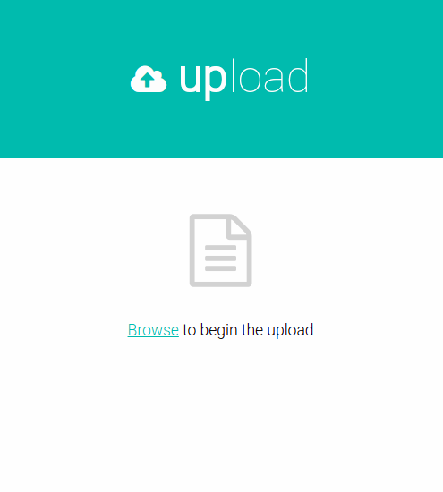

# CSV File Upload

<p align="center"></p>

## Description
A self-learning project (work in progress) written in ```Python``` which provides a simple button on the frontend to upload a CSV file, and then pushes it to the database.

## Tech Stack
* HTML to receive .CSV file using jinja2 template
* Pyramid as a web framework
* SQLAlchemy for database management
* SQLite and Postgres as Database
* jQuery + HTML + CSS template for file upload

## Steps followed
* Read .ini file for database details
* Receive file via browse button
* Detect schema of .csv file (Currently INT, REAL and TEXT supported)
* Sanitize filename by keeping alphanumeric characters
* Create table with a dynamic SQL query with this new sanitized name and correct schema type
* Insert into table using a SQL query
  * In case of Postgres database, COPY command is first tried to make fast bulk inserts, but if it fails, the code falls back to slow inserting into the table, row by row
* Retrieve the table from database and send rows as JSON to frontend
* Display table using [DataTables](https://datatables.net/)

## How to run
* Open config.ini and set database configuration.
  * db_type can be either 'sqlite' or 'postgres'
  * For 'sqlite' type, only db_name is required, other parameters will be ignored
* Run the following command
```console
./python3 app.py
```

* Visit http://localhost:6543/
* Select a CSV file which is UTF-8 compatable, and has the first row as headers.
* Two endpoints have been included:
  * /datasets to view the currently added tables
  * /columns/{table_name} to view the columns under a table 

## Future improvements
* Add more test cases

## References
* [Process CSV file from web form with Python](https://stackoverflow.com/questions/22009034/how-to-process-uploaded-csv-file-from-web-form-with-python-3)
* [Validate Date Format](https://stackoverflow.com/questions/16870663/how-do-i-validate-a-date-string-format-in-python)
* [Execute SQL with SQLAlchemy](https://chartio.com/resources/tutorials/how-to-execute-raw-sql-in-sqlalchemy/)
* [Insert CSV into database](https://python.plainenglish.io/comparison-of-methods-for-importing-bulk-csv-data-into-mysql-using-python-5890dbf57419)
* [Render Pandas Dataframe as HTML](https://www.geeksforgeeks.org/rendering-data-frame-to-html-template-in-table-view-using-django-framework/)
* [File upload templates](https://freshdesignweb.com/jquery-html5-file-upload/)
